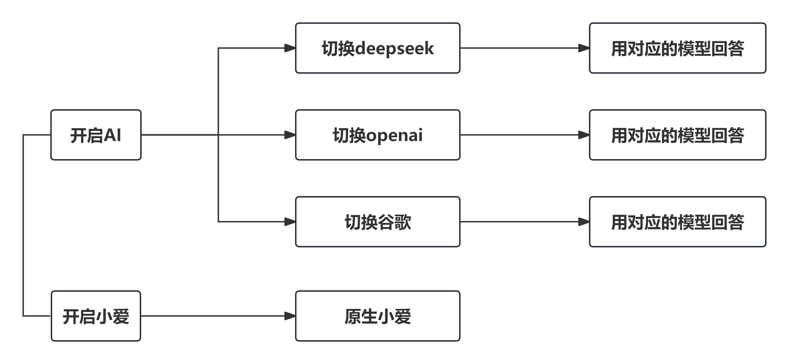

# 超智能音箱项目

## 项目主要实现功能
* 保留原生小爱模式
* 增加AI模式，在AI模式下可以切换不同的模型
  

## 安装git
### openwrt/iStoreOS系统
```bash
opkg update
opkg install git git-http ca-bundle
```
### 拉取项目
```
git clone https://github.com/slobys/xiaoai.git .
```
### [Open-XiaoAI](https://github.com/idootop/open-xiaoai)
### [小爱音箱刷机教程](https://github.com/idootop/open-xiaoai/blob/main/docs/flash.md)


  
